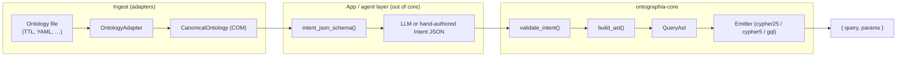

# Architecture

Ontographia separates **what the graph schema allows** (ontology) from **what the user wants to find** (Intent JSON). The Rust core owns parsing, validation, AST construction, and emission. Language bindings are thin wrappers; LLM / agent layers sit outside the core and must never emit raw Cypher.

## End-to-end pipeline



At runtime the public entry point is `Engine::build()`:

```27:31:crates/ontographia-core/src/engine.rs
    pub fn build(&self, intent: Intent, dialect: Dialect) -> Result<EmittedQuery> {
        let validated = validate_intent(&self.ontology, intent)?;
        let ast = build_ast(&self.ontology, &validated)?;
        emit_query(dialect, &ast, &validated.params)
    }
```

## Design principles

| Principle | Implication |
|-----------|-------------|
| **Ontology is source of truth** | Valid `class`, `relationship`, and `property` names come only from COM after adapter parsing. |
| **LLMs emit Intent, not Cypher** | Schema-constrained JSON is validated before any query text is produced. |
| **Parameter binding** | Filter literals are extracted into `params` (`param_0`, `param_1`, …) and referenced as `$param_N` in emitted Cypher. |
| **Determinism** | Same ontology + Intent + dialect → same `{ query, params }`. |
| **Single implementation** | Extend `ontographia-core` / `ontographia-adapters`; do not duplicate logic in bindings. |

## Crate layout

| Crate | Responsibility |
|-------|----------------|
| [`ontographia-adapters`](../crates/ontographia-adapters/) | Format detection, `OntologyAdapter` implementations, `load_ontology()` |
| [`ontographia-core`](../crates/ontographia-core/) | COM, Intent types, validation, QueryAst, emitters, `Engine` |
| [`ontographia-schema`](../crates/ontographia-schema/) | COM → expected Neo4j graph schema, constraint DDL, offline catalog diff |
| [`ontographia-ffi`](../crates/ontographia-ffi/) | Stable C ABI for non-Rust callers |
| [`bindings/python`](../bindings/python/) | PyO3 wrapper around `Engine` |
| [`bindings/go`](../bindings/go/) | cgo wrapper over `ontographia-ffi` |

## Stage 1 — Ontology ingestion

### Adapter registry

`AdapterRegistry::load()` probes adapters in a fixed order (native YAML → LinkML → OBO → JSON-LD → Turtle/OWL → SHACL → SKOS) using `detect()` heuristics on bytes and optional path hints.

Each adapter implements:

```4:11:crates/ontographia-adapters/src/registry.rs
pub trait OntologyAdapter {
    fn name(&self) -> &'static str;
    fn detect(source: &[u8], path_hint: Option<&str>) -> bool;
    fn parse(source: &[u8]) -> Result<CanonicalOntology>
    where
        Self: Sized;
    fn supported_extensions() -> &'static [&'static str];
}
```

Adapters **must** map their source format into COM. There is no alternate internal representation.

### Canonical Ontology Model (COM)

COM is the shared intermediate representation for all formats. JSON Schema: [`schemas/com.schema.json`](../schemas/com.schema.json).

| COM section | Purpose |
|-------------|---------|
| `classes` | Node labels, optional IRI, `super_classes` for inheritance |
| `relationships` | Edge types with optional `from_class` / `to_class` domain/range |
| `properties` | Datatype properties per owner class |
| `constraints` | SHACL-style hints (min/max count, pattern, …) |
| `namespaces` | Prefix → IRI map from source ontology |
| `source` | Provenance (`format`, `uri`, `version`) |

`CanonicalOntology` exposes resolution helpers used during validation: `resolve_class`, `resolve_relationship`, `resolve_property` (with inheritance via `ancestor_classes`), and `is_subclass_of`.

## Stage 2 — Intent JSON schema (LLM boundary)

`Engine::intent_json_schema()` generates a JSON Schema for the `Intent` struct and **injects ontology-specific enums** for `class` and `relationship` fields so constrained decoding / tool schemas cannot invent schema names.

```3:7:crates/ontographia-core/src/schema_gen.rs
pub fn intent_json_schema(ontology: &CanonicalOntology) -> serde_json::Value {
    let mut schema = serde_json::to_value(schemars::schema_for!(crate::intent::Intent))
        .expect("schema serialization");
    enrich_with_ontology(&mut schema, ontology);
    schema
}
```

Intent extraction (LLM prompts, retries, repair) lives in the **application layer** — see [skills/ontographia-cypher-builder/SKILL.md](../skills/ontographia-cypher-builder/SKILL.md) and [docs/end-to-end-neo4j.md](end-to-end-neo4j.md). The core only defines the shape and validates instances.

### Intent structure

| Field | Role |
|-------|------|
| `start` | `{ class, alias }` — anchor node of the pattern |
| `traverse` | Ordered relationship hops (`relationship`, `direction`, `to`, optional `min_hops` / `max_hops`) |
| `filter` | Property predicates on bound aliases |
| `return` | Projections (property, whole node, or aggregate) |
| `order_by`, `limit`, `skip` | Result shaping |
| `optional` | When true, `OPTIONAL MATCH` instead of `MATCH` |

Types: [`crates/ontographia-core/src/intent.rs`](../crates/ontographia-core/src/intent.rs)

## Stage 3 — Validation

`validate_intent()` checks Intent against COM **before** AST construction:

1. **Classes** — `start.class` and each `traverse.to.class` must exist in COM.
2. **Relationships** — each `traverse.relationship` must exist; `from_class` / `to_class` must align with the path (subclass-aware).
3. **Aliases** — unique across the pattern; filter/return aliases must refer to nodes in the pattern.
4. **Properties** — filter and return properties must exist on the resolved class (inheritance-aware).
5. **Return** — at least one `return` item required.

On success, filter literal values are copied into `ValidatedIntent.params` as `param_0`, `param_1`, … — never embedded in query strings.

Implementation: [`crates/ontographia-core/src/validate.rs`](../crates/ontographia-core/src/validate.rs)

## Stage 4 — QueryAst

`build_ast()` maps validated Intent to a dialect-neutral `QueryAst`:

- `MatchClause` — linear node/relationship chain (one `PatternNode` today)
- `FilterNode` — references `$param_N` by name, not inline values
- `ReturnNode` — property, node, or aggregate expressions
- `order_by`, `limit`, `skip`

The AST is intentionally close to Cypher/GQL structure but **not** a string template. Emitters own syntax details (`FILTER` vs `WHERE`, `CYPHER 25` prefix, etc.).

Types: [`crates/ontographia-core/src/ast/mod.rs`](../crates/ontographia-core/src/ast/mod.rs)

## Stage 5 — Emission

`emit_query(dialect, ast, params)` dispatches to a `QueryEmitter` implementation:

| Dialect | Emitter | Notes |
|---------|---------|-------|
| `cypher25` (default) | `Cypher25Emitter` | `CYPHER 25` prefix, `FILTER` clause — Neo4j 2025.06+ |
| `cypher5` | `Cypher5Emitter` | Legacy `WHERE` for older Neo4j |
| `gql` | `GqlEmitter` | GQL-oriented prototype |

Output is always `EmittedQuery { query, params }`. Filter values appear only in `params`; the query string contains `$param_N` placeholders.

Implementation: [`crates/ontographia-core/src/emit/`](../crates/ontographia-core/src/emit/)

## Bindings

Bindings call the same `Engine` API; they do not fork validation or emission.

| Language | Mechanism | Typical use |
|----------|-----------|-------------|
| Rust | Direct `Engine::new(load_ontology(...))` | Libraries, examples, tests |
| Python | PyO3 `Engine.load()` / `build()` | Demos, Neo4j scripts, LLM E2E |
| Go | C FFI `ontographia_build_cypher_from_json` | Backend services |

See [bindings/README.md](../bindings/README.md).

## Graph schema governance (`ontographia-schema`)

Ontographia **core** validates Intent against COM; it does **not** verify that a live Neo4j database matches the ontology. That boundary is handled by [`ontographia-schema`](../crates/ontographia-schema/):

```
COM → GraphSchema::from_com()
         ├─ emit_cypher25_constraints()  → CREATE CONSTRAINT DDL
         └─ diff(schema, GraphSnapshot)  → missing/extra labels & rel types
```

| API | Purpose |
|-----|---------|
| `GraphSchema::from_com` | Derive expected node labels, relationship types, and `unique` properties from COM |
| `emit_cypher25_constraints` | Generate `CREATE CONSTRAINT … IF NOT EXISTS` for properties marked `unique: true` in the ontology |
| `GraphSnapshot` | Offline JSON catalog (`labels`, `relationship_types`) — e.g. [`examples/neo4j/catalog.snapshot.json`](../examples/neo4j/catalog.snapshot.json) |
| `diff` | Report schema drift between COM-derived expectations and a snapshot |

CLI example:

```bash
cargo run -p ontographia-schema --example emit_constraints -- examples/manufacturing.native.yaml
cargo run -p ontographia-schema --example emit_constraints -- examples/manufacturing.native.yaml --snapshot examples/neo4j/catalog.snapshot.json
```

**Out of scope (v1):** Neo4j live introspection, data seed generation, automatic migration execution. Seed data remains in [`examples/neo4j/seed.cypher`](../examples/neo4j/seed.cypher); generated constraints are tested for semantic equivalence.

Mark business-key properties with `unique: true` in native ontology YAML (see [`examples/manufacturing.native.yaml`](../examples/manufacturing.native.yaml)).

**Roles and guarantees (ontology ↔ Neo4j ↔ executable queries):** [ontology-graph-alignment.md](ontology-graph-alignment.md)

## What is intentionally outside the core

| Concern | Where it lives |
|---------|----------------|
| LLM API calls | App layer (`examples/`, agent skills) |
| Neo4j driver / execution | `examples/run_neo4j_demo.py`, user applications |
| RDF reasoning / OWL entailment | Out of scope — adapters extract asserted schema only |
| Ontology ↔ Neo4j catalog alignment | [`ontographia-schema`](../crates/ontographia-schema/) (offline diff + constraint DDL) |
| Graph data seeding | [`examples/neo4j/seed.cypher`](../examples/neo4j/seed.cypher) |

## Extension points

| Change | Steps |
|--------|-------|
| **New ontology format** | Implement `OntologyAdapter` → map to COM → register in `registry.rs` → add example + integration test |
| **New Intent capability** | Extend `Intent` + validation + `build_ast` + **all** emitters |
| **New dialect** | Add `QueryEmitter` + `Dialect` variant |
| **New language binding** | Prefer `ontographia-ffi` C ABI or direct Rust crate dependency |
| **Graph schema / constraints** | Extend `ontographia-schema` (`from_com`, `emit`, `diff`) |

## Related docs

- Neo4j walkthrough (seed data, execute queries): [end-to-end-neo4j.md](end-to-end-neo4j.md)
- Ontology ↔ graph alignment, who owns what, `schema.json` usage: [ontology-graph-alignment.md](ontology-graph-alignment.md)
- Agent golden rules and entry points: [AGENTS.md](../AGENTS.md)
- COM / native ontology JSON Schemas: [schemas/](../schemas/)
