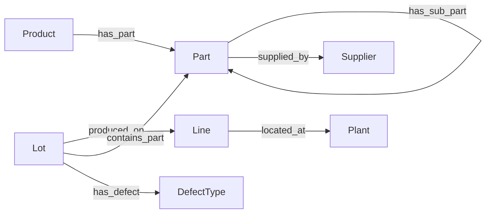

# End-to-end Neo4j tutorial — manufacturing domain

This walkthrough uses a **manufacturing property graph** inspired by ISA-95 concepts: multi-level BOM, tiered suppliers, plant/line hierarchy, and lot traceability. The same ontology semantics are expressed in four formats, loaded into Neo4j, and queried deterministically via Ontographia Intent JSON.

## Scenario

**SmartPump X** (`SPX-100`) is assembled from a drive unit and housing. The drive unit contains a servo motor supplied by a tier-1 vendor; the housing comes from a tier-2 supplier. Production lots are traced to lines and plants; one lot is quarantined with a surface-scratch defect.

This mirrors common digital-twin / supply-chain-risk graph patterns (BOM + site + lot + supplier), not the Neo4j Movie Graph — but the workflow is the same: ontology → seed → intent → Cypher 25.

## Graph model



### Classes

| Class | Description | Standards alignment |
|-------|-------------|---------------------|
| `Product` | Finished good | ISA-95 material produced |
| `Part` | BOM component / sub-assembly | IOF Core / OPC UA material |
| `Supplier` | Tiered vendor | Supply-chain risk graphs |
| `Plant` | Manufacturing site | ISA-95 Site |
| `Line` | Production line | ISA-95 Area / Work Center |
| `Lot` | Production lot | Lot traceability |
| `DefectType` | Quality defect code | SAREF4INMA / internal QMS |

### Relationships

| Relationship | From | To |
|--------------|------|-----|
| `has_part` | `Product` | `Part` |
| `has_sub_part` | `Part` | `Part` |
| `supplied_by` | `Part` | `Supplier` |
| `located_at` | `Line` | `Plant` |
| `produced_on` | `Lot` | `Line` |
| `contains_part` | `Lot` | `Part` |
| `has_defect` | `Lot` | `DefectType` |

### Key properties

| Property | Owner class | Type |
|----------|-------------|------|
| `sku` | `Product` | string |
| `part_number` | `Part` | string |
| `lead_time_days` | `Part` | integer |
| `name` | `Product`, `Part`, `Supplier`, `Plant`, `Line` | string |
| `tier`, `country` | `Supplier` | integer, string |
| `region` | `Plant` | string |
| `lot_id`, `quantity`, `status` | `Lot` | string / integer / string |
| `code`, `description` | `DefectType` | string |

## Ontology files (same semantics, different syntax)

| Format | File |
|--------|------|
| Native YAML (LinkML-style internal) | [`manufacturing.native.yaml`](../examples/manufacturing.native.yaml) |
| Turtle / OWL (IOF-inspired) | [`manufacturing.owl.ttl`](../examples/manufacturing.owl.ttl) |
| JSON-LD | [`manufacturing.jsonld`](../examples/manufacturing.jsonld) |
| LinkML | [`manufacturing.linkml.yaml`](../examples/manufacturing.linkml.yaml) |
| OBO (taxonomy-style classes) | [`manufacturing.obo`](../examples/manufacturing.obo) |

## 1. Start Neo4j

Use **Neo4j 2025.06+** with Cypher 25 support.

```bash
./scripts/start_neo4j.sh --seed
```

Defaults: container `ontographia-neo4j`, Browser `http://localhost:7474`, Bolt `bolt://localhost:7687`, password `ontographia`. Override with `NEO4J_HTTP_PORT`, `NEO4J_BOLT_PORT`, `NEO4J_PASSWORD`, etc.

Manual Docker run (alternative):

```bash
docker run -d --name neo4j \
  -p 7474:7474 -p 7687:7687 \
  -e NEO4J_AUTH=neo4j/your-password \
  neo4j:2025.06
```

## 2. Load seed data

[`examples/neo4j/seed.cypher`](../examples/neo4j/seed.cypher) creates:

1. **Constraints** — uniqueness on `Product.sku`, `Part.part_number`, `Lot.lot_id`, `Supplier.name`
2. **BOM** — `SPX-100` → drive unit + housing; drive → motor (`has_sub_part`); flattened `has_part` to motor for traceability queries
3. **Suppliers** — `MikroMotors` (tier 1, JP) → motor; `FormTech` (tier 2, TW) → housing
4. **Site / line** — `Line-1` @ Nagoya, `Line-2` @ Osaka
5. **Lots** — `LOT-2024-001` (released), `LOT-2024-002` (quarantine + `SURFACE_SCRATCH` defect)

```bash
cypher-shell -u neo4j -p your-password -f examples/neo4j/seed.cypher
```

Or with the dev container running:

```bash
./scripts/load_neo4j_seed.sh
```

### Seed graph (ASCII)

```
(SPX-100:Product)
  -[:has_part]-> (P-DRV-010:Part) -[:has_sub_part]-> (P-MOT-001:Motor) -[:supplied_by]-> (MikroMotors)
  -[:has_part]-> (P-HOU-002:Housing) -[:supplied_by]-> (FormTech)
  -[:has_part]-> (P-MOT-001)   // flattened BOM edge

(Line-1) -[:located_at]-> (Nagoya Plant)
(LOT-2024-001) -[:produced_on]-> (Line-1)
(LOT-2024-002) -[:has_defect]-> (SURFACE_SCRATCH)   status: quarantine
```

## 3. Demo intent — suppliers for a product SKU

> List supplier names for all direct BOM parts of product `SPX-100`.

```json
{
  "start": { "class": "Product", "alias": "product" },
  "traverse": [
    {
      "relationship": "has_part",
      "direction": "out",
      "to": { "class": "Part", "alias": "part" }
    },
    {
      "relationship": "supplied_by",
      "direction": "out",
      "to": { "class": "Supplier", "alias": "supplier" }
    }
  ],
  "filter": [
    { "alias": "product", "property": "sku", "op": "eq", "value": "SPX-100" }
  ],
  "return": [
    { "alias": "supplier", "property": "name", "as_name": "supplier_name" }
  ],
  "limit": 20
}
```

### Generate Cypher (Rust)

```bash
cargo run -p ontographia-adapters --example intent_to_cypher -- examples/manufacturing.native.yaml
```

Any supported ontology format works:

```bash
cargo run -p ontographia-adapters --example intent_to_cypher -- examples/manufacturing.owl.ttl
cargo run -p ontographia-adapters --example intent_to_cypher -- examples/manufacturing.jsonld
cargo run -p ontographia-adapters --example intent_to_cypher -- examples/manufacturing.linkml.yaml
```

### Generate Cypher (Python)

```python
import ontographia

engine = ontographia.Engine.load("examples/manufacturing.owl.ttl")  # any supported format
result = engine.build({
    "start": {"class": "Product", "alias": "product"},
    "traverse": [
        {"relationship": "has_part", "direction": "out", "to": {"class": "Part", "alias": "part"}},
        {"relationship": "supplied_by", "direction": "out", "to": {"class": "Supplier", "alias": "supplier"}},
    ],
    "filter": [{"alias": "product", "property": "sku", "op": "eq", "value": "SPX-100"}],
    "return": [{"alias": "supplier", "property": "name", "as_name": "supplier_name"}],
    "limit": 20,
})
print(result["query"])
print(result["params"])
```

Expected emitted shape:

```cypher
CYPHER 25
MATCH (product:Product)-[:has_part]->(part:Part)-[:supplied_by]->(supplier:Supplier)
FILTER product.sku = $param_0
RETURN supplier.name AS supplier_name
LIMIT 20
```

## 4. Execute against Neo4j

```bash
uv sync --group dev
uv run maturin develop --release

export NEO4J_PASSWORD=your-password
python examples/run_neo4j_demo.py --ontology examples/manufacturing.linkml.yaml --execute
```

Or with cypher-shell:

```bash
cypher-shell -u neo4j -p your-password \
  "CYPHER 25 MATCH (product:Product)-[:has_part]->(part:Part)-[:supplied_by]->(supplier:Supplier) FILTER product.sku = \$param_0 RETURN supplier.name AS supplier_name LIMIT 20" \
  --param "param_0 => 'SPX-100'"
```

### Expected result

```json
[
  { "supplier_name": "MikroMotors" },
  { "supplier_name": "FormTech" }
]
```

`MikroMotors` is reached via the flattened `has_part` edge to the motor; `FormTech` via the housing. The drive unit (`P-DRV-010`) has no `supplied_by` edge — sub-assembly suppliers require a `has_sub_part` traverse step (see below).

## 5. Alternate intents (same ontology)

### Lot traceability — parts in a lot

```json
{
  "start": { "class": "Lot", "alias": "lot" },
  "traverse": [
    { "relationship": "contains_part", "direction": "out", "to": { "class": "Part", "alias": "part" } }
  ],
  "filter": [{ "alias": "lot", "property": "lot_id", "op": "eq", "value": "LOT-2024-001" }],
  "return": [{ "alias": "part", "property": "part_number", "as_name": "part_number" }]
}
```

### Quarantine lots with defects

```json
{
  "start": { "class": "Lot", "alias": "lot" },
  "traverse": [
    { "relationship": "has_defect", "direction": "out", "to": { "class": "DefectType", "alias": "defect" } }
  ],
  "filter": [{ "alias": "lot", "property": "status", "op": "eq", "value": "quarantine" }],
  "return": [{ "alias": "defect", "property": "code", "as_name": "defect_code" }]
}
```

Expected: `SURFACE_SCRATCH` for `LOT-2024-002`.

### Plant for a production line

```json
{
  "start": { "class": "Line", "alias": "line" },
  "traverse": [
    { "relationship": "located_at", "direction": "out", "to": { "class": "Plant", "alias": "plant" } }
  ],
  "filter": [{ "alias": "line", "property": "name", "op": "eq", "value": "Line-1" }],
  "return": [{ "alias": "plant", "property": "name", "as_name": "plant_name" }]
}
```

Expected: `Nagoya Plant`.

### Deep BOM — motor via sub-assembly (no flattened edge)

Add a `has_sub_part` step between `has_part` and `supplied_by` to traverse `Product → Drive Unit → Motor → Supplier` without relying on the flattened edge.

## 6. Verify all ontology formats

```bash
cargo test --workspace
```

Integration tests load each `examples/manufacturing.*` file and assert Cypher 25 output for the supplier intent.

```bash
for f in examples/manufacturing.native.yaml \
         examples/manufacturing.owl.ttl \
         examples/manufacturing.jsonld \
         examples/manufacturing.linkml.yaml; do
  cargo run -p ontographia-adapters --example intent_to_cypher -- "$f"
done
```

## Troubleshooting

| Symptom | Likely cause |
|---------|----------------|
| `unknown class: Product` | Ontology parse failure — check path and format |
| Empty supplier result | Seed not loaded, or only sub-assemblies traversed without `has_sub_part` |
| `Invalid input 'FILTER'` | Neo4j version < 2025.06 — use `cypher5` dialect or upgrade |
| Duplicate suppliers | Add `DISTINCT` manually post-generation (future engine feature) |

## References

- [ISA-95 enterprise-control integration](https://www.isa.org/standards-and-publications/isa-standards/isa-standards-committees/isa95)
- [IOF Core ontology](https://www.industrialontologies.org/iof-core-ontology/)
- [SAREF4INMA](https://saref.etsi.org/saref4inma) — manufacturing assets extension
- Neo4j supply-chain / digital-twin GraphGists (community examples)
