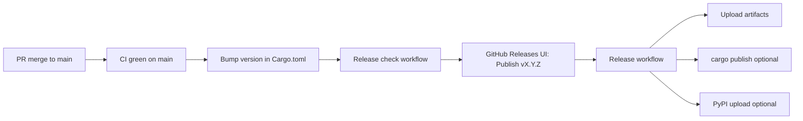

# Release workflow

Ontographia ships **Rust crates + CLI**, a **Python wheel** (PyPI), and **Go bindings** (cgo + FFI). Releases are cut from `main` only.

## Flow



1. Merge feature work to `main` and confirm [CI](https://github.com/edgesentry/ontographia/actions/workflows/ci.yml) passes.
2. Bump the workspace version on `main` (see [Version bumps](#version-bumps)) — **no local git tag**.
3. Run **[Release check](https://github.com/edgesentry/ontographia/actions/workflows/release-check.yml)** from Actions:
   - **Run workflow** → branch `main` → version e.g. `0.1.1`
   - Must pass (tests, `cargo publish --dry-run`, wheel build)
4. Create the release on GitHub:
   - **Releases → Draft a new release**
   - **Choose a tag:** `v0.1.1` (create new tag on `main`)
   - Add release notes (optional)
   - **Publish release** (not draft-only if you want the pipeline to run)
5. [Release workflow](../.github/workflows/release.yml) runs on `release: published`:
   - Verifies tag matches `Cargo.toml`
   - Builds CLI / FFI / wheels
   - Uploads assets to the GitHub Release you just created
   - Tags `bindings/go/vX.Y.Z`
   - Optionally publishes to crates.io / PyPI

> **Do not** `git push` tags manually — use the Releases UI so the release page and tag are created together.

## Version bumps

**Single source of truth:** root `Cargo.toml` → `[workspace.package] version`.

| Component | Where version lives |
|-----------|---------------------|
| Rust (all crates) | `version.workspace = true` → workspace version |
| Python wheel | `pyproject.toml` `dynamic = ["version"]` → `bindings/python/Cargo.toml` via maturin |
| Go | No file; `bindings/go/vX.Y.Z` tag created by the release workflow |

```bash
# bump + test + commit (push to main via PR)
scripts/bump-version.sh 0.1.1 --commit
```

The release workflow rejects tags that do not match the workspace version (`scripts/verify-release-version.sh`).

**Immutable tags:** a version must not be re-released. `Release check` fails if `vX.Y.Z`, `release-processed/vX.Y.Z`, or `bindings/go/vX.Y.Z` already exists on the remote. The `Release` workflow claims `release-processed/vX.Y.Z` immediately and fails on any re-run or duplicate publish.

Local pre-flight (same checks as the Release check workflow):

```bash
bash scripts/verify-release-version.sh v0.1.1
bash scripts/release-check.sh
```

## GitHub secrets (optional registry publish)

| Secret | Purpose |
|--------|---------|
| `CARGO_REGISTRY_TOKEN` | `cargo publish` for `ontographia-core`, `-adapters`, `-schema`, `-cli` |
| `PYPI_API_TOKEN` | `maturin upload` to PyPI |

| Variable | Purpose |
|----------|---------|
| `PUBLISH_TO_REGISTRIES` | Set to `true` to enable crates.io / PyPI publish jobs |

Without registry settings, the workflow still uploads **GitHub Release assets**.

## Install after release

### CLI (GitHub Release or crates.io)

```bash
cargo install ontographia-cli
```

```bash
ontographia build --ontology manufacturing.native.yaml --intent intent.json --json
ontographia schema manufacturing.native.yaml --out constraints.cypher --json-out schema.json
```

### Rust libraries

```toml
ontographia-core = "0.1"
ontographia-adapters = "0.1"
ontographia-schema = "0.1"
```

### Python

Supported: **3.11, 3.12, 3.13** (`requires-python = ">=3.11"`). CI runs Python smoke and Neo4j integration on all three; releases ship Linux wheels for each.

```bash
pip install ontographia
```

### Go

```bash
go get github.com/edgesentry/ontographia/bindings/go@v0.1.1
```

Download the matching `libontographia_ffi-*` archive from GitHub Releases for cgo linking.

The release workflow creates `bindings/go/vX.Y.Z` automatically when the GitHub Release is published.

## Artifacts

| Artifact | Contents |
|----------|----------|
| `ontographia-{version}-{target}.tar.gz` | `ontographia` CLI binary |
| `libontographia_ffi-{version}-{target}.tar.gz` | Shared library for Go/cgo |
| `ontographia-{version}-*.whl` | Python package |

## Related

- [architecture.md](architecture.md)
- [AGENTS.md](../AGENTS.md)
