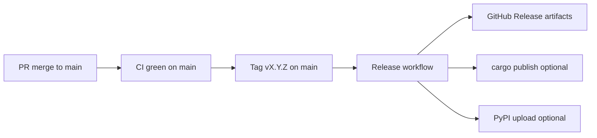

# Release workflow

Ontographia ships **Rust crates + CLI**, a **Python wheel** (PyPI), and **Go bindings** (cgo + FFI). Releases are cut from `main` only.

## Flow



1. Merge feature work to `main` and confirm [CI](https://github.com/edgesentry/ontographia/actions/workflows/ci.yml) passes.
2. Bump the workspace version (see [Version bumps](#version-bumps)).
3. Push the bump commit to `main`, then tag:

   ```bash
   git checkout main && git pull
   scripts/bump-version.sh 0.2.0 --commit --tag --push
   ```

   Or bump and tag in separate steps:

   ```bash
   scripts/bump-version.sh 0.2.0 --commit
   git push origin main
   git tag -a v0.2.0 -m "Release v0.2.0"
   git push origin v0.2.0
   ```

4. The [Release workflow](../.github/workflows/release.yml) runs on `v*` tags:
   - Runs `cargo test --workspace` and CLI smoke test
   - Builds `ontographia` CLI binaries (Linux, macOS, Windows)
   - Builds `libontographia_ffi` per platform (for Go consumers)
   - Builds Python wheels (`maturin build`)
   - Creates a GitHub Release with all artifacts
   - Optionally publishes to crates.io / PyPI when secrets are configured

## Version bumps

**Single source of truth:** root `Cargo.toml` → `[workspace.package] version`.

| Component | Where version lives |
|-----------|---------------------|
| Rust (all crates) | `version.workspace = true` → workspace version |
| Python wheel | `pyproject.toml` `dynamic = ["version"]` → `bindings/python/Cargo.toml` via maturin |
| Go | No file; `bindings/go/vX.Y.Z` tag created by the release workflow |

```bash
# preview: updates Cargo.toml only
scripts/bump-version.sh 0.2.0

# bump + test + commit + tag + push (on main)
scripts/bump-version.sh 0.2.0 --commit --tag --push
```

The release workflow rejects tags that do not match the workspace version (`scripts/verify-release-version.sh`).

## GitHub secrets (optional registry publish)

| Secret | Purpose |
|--------|---------|
| `CARGO_REGISTRY_TOKEN` | `cargo publish` for `ontographia-core`, `-adapters`, `-schema`, `-cli` |
| `PYPI_API_TOKEN` | `maturin upload` to PyPI |

Without these secrets, the workflow still uploads **GitHub Release artifacts** only.

## Install after release

### CLI (GitHub Release or crates.io)

```bash
# from crates.io (after publish)
cargo install ontographia-cli

# or download ontographia-*-linux-x86_64.tar.gz from GitHub Releases
```

```bash
ontographia build --ontology manufacturing.native.yaml --intent intent.json --json
ontographia schema manufacturing.native.yaml --out constraints.cypher --json-out schema.json
```

### Rust libraries

```toml
ontographia-core = "0.1"
ontographia-adapters = "0.1"
ontographia-schema = "0.1"
```

### Python

```bash
pip install ontographia
```

Requires a wheel matching your platform (built by the release workflow).

### Go

Go bindings use **cgo** and link `libontographia_ffi`. After release:

```bash
go get github.com/edgesentry/ontographia/bindings/go@v0.1.0
```

Download the matching `libontographia_ffi-*` archive from GitHub Releases and set `LD_LIBRARY_PATH` (Linux), `DYLD_LIBRARY_PATH` (macOS), or PATH (Windows) to the directory containing the shared library. Then build your app with `CGO_ENABLED=1`.

Tag convention for the Go submodule:

```bash
git tag bindings/go/v0.1.0 <commit-on-main>
git push origin bindings/go/v0.1.0
```

The release workflow creates this tag automatically when the root tag `v0.1.0` is pushed.

## Artifacts

| Artifact | Contents |
|----------|----------|
| `ontographia-{version}-{target}.tar.gz` | `ontographia` CLI binary |
| `libontographia_ffi-{version}-{target}.tar.gz` | Shared library for Go/cgo |
| `ontographia-{version}-*.whl` | Python package |
| Source archive | GitHub auto-generated zip/tar.gz |

## Related

- [architecture.md](architecture.md)
- [AGENTS.md](../AGENTS.md)
