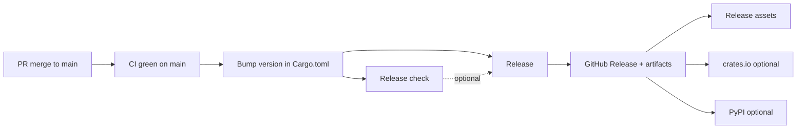

# Release workflow

Ontographia ships **Rust crates + CLI**, a **Python wheel** (PyPI), and **Go bindings** (cgo + FFI). Releases are cut from `main` only.

**Trigger policy:** [Release check](https://github.com/edgesentry/ontographia/actions/workflows/release-check.yml) and [Release](https://github.com/edgesentry/ontographia/actions/workflows/release.yml) run **only** via **Run workflow** (`workflow_dispatch`). They **never** start on push to `main`, tag push, or GitHub Release publish events.

## Flow



1. Merge feature work to `main` and confirm [CI](https://github.com/edgesentry/ontographia/actions/workflows/ci.yml) passes.
2. Bump the workspace version on `main` (see [Version bumps](#version-bumps)) — **no local git tag**.
3. **(Recommended)** Run **[Release check](https://github.com/edgesentry/ontographia/actions/workflows/release-check.yml)** — dry-run only; no tag or release is created.
4. Run **[Release](https://github.com/edgesentry/ontographia/actions/workflows/release.yml)** — reads `Cargo.toml`, creates `vX.Y.Z`, uploads artifacts.

Both workflows share the same internal validation (`scripts/preflight-release.sh`). **No version input** — bump `Cargo.toml` on `main` first.

**Immutable tags:** preflight fails if `vX.Y.Z`, `release-processed/vX.Y.Z`, or `bindings/go/vX.Y.Z` already exists on the remote. After a successful Release start, `release-processed/vX.Y.Z` is claimed; the same version cannot be re-released — bump the version in `Cargo.toml`.

## Option A — GitHub Actions

### Release check (dry-run)

1. Open **Actions → Release check**.
2. Click **Run workflow** (branch `main`).
3. Confirm the run passes (version from `Cargo.toml`, tests, `cargo publish --dry-run` for `ontographia-core`, wheel build).

No tag or GitHub Release is created.

### Release (publish)

1. Bump `[workspace.package] version` in `Cargo.toml` on `main` (see [Version bumps](#version-bumps)).
2. Open **Actions → Release**.
3. Click **Run workflow** (branch `main`) — no version field; the workflow reads `Cargo.toml`.

Preflight runs internally, then the workflow creates `vX.Y.Z`, the GitHub Release, and uploads assets.

## Option B — CLI

Requires [GitHub CLI](https://cli.github.com/) (`gh`) authenticated with `repo` scope.

### Release check only

```bash
bash scripts/preflight-release.sh
# or trigger the Release check workflow:
gh workflow run "Release check" --ref main
```

### Full release

```bash
# 1. Bump version on main (via PR or locally)
scripts/bump-version.sh 0.1.2 --commit
git push origin main

# 2. (Recommended) dry-run
bash scripts/preflight-release.sh
# or: gh workflow run "Release check" --ref main

# 3. Preflight locally + trigger Release workflow
scripts/trigger-release.sh

# 4. Watch the run
gh run watch --workflow Release
```

`trigger-release.sh` reads `Cargo.toml`, runs `preflight-release.sh`, then `gh workflow run Release`. The Release workflow still runs preflight on the runner.

### Preflight steps (shared by Release check and Release)

```bash
VERSION="$(bash scripts/workspace-version.sh)"
bash scripts/verify-release-version.sh "v${VERSION}"
bash scripts/verify-tag-not-exists.sh "v${VERSION}"
bash scripts/release-check.sh
```

(`preflight-release.sh` runs all three using the workspace version.)

### Trigger Release only (skip local preflight)

```bash
gh workflow run Release --ref main
```

## Version bumps

**Single source of truth:** root `Cargo.toml` → `[workspace.package] version`.

| Component | Where version lives |
|-----------|---------------------|
| Rust (all crates) | `version.workspace = true` → workspace version |
| Python wheel | `pyproject.toml` `dynamic = ["version"]` → `bindings/python/Cargo.toml` via maturin |
| Go | No file; `bindings/go/vX.Y.Z` tag created by the release workflow |

```bash
scripts/bump-version.sh 0.1.2 --commit
```

The release workflow rejects versions that do not match `Cargo.toml` (`scripts/verify-release-version.sh`).

## GitHub secrets (optional registry publish)

| Secret | Purpose |
|--------|---------|
| `CARGO_REGISTRY_TOKEN` | `cargo publish` for `ontographia-core`, `-adapters`, `-schema`, `-cli` |
| `PYPI_API_TOKEN` | `maturin upload` to PyPI |

| Variable | Purpose |
|----------|---------|
| `PUBLISH_TO_REGISTRIES` | Set to `true` to enable crates.io / PyPI publish jobs |

Without registry settings, the workflow still uploads **GitHub Release assets**.

### Re-running a failed Release

If a Release run fails partway through (for example after `ontographia-core` was already published, or after the Go module tag was pushed), fix the workflow or bump the version as needed, then **Run workflow** again on the same `Cargo.toml` version:

- **crates.io:** publish jobs skip crates that already exist at the workspace version.
- **Go:** the workflow fails fast if `bindings/go/vX.Y.Z` already exists — do not delete that tag; bump the version instead.
- **GitHub Release assets:** the upload step overwrites release files when re-run succeeds.

## Install after release

### CLI (GitHub Release or crates.io)

```bash
cargo install ontographia-cli
```

```bash
ontographia build --ontology manufacturing.native.yaml --intent intent.json --json
ontographia schema manufacturing.native.yaml --out constraints.cypher --json-out schema.json
```

### Rust libraries

```toml
ontographia-core = "0.1"
ontographia-adapters = "0.1"
ontographia-schema = "0.1"
```

### Python

Supported: **3.11, 3.12, 3.13** (`requires-python = ">=3.11"`). CI runs Python smoke and Neo4j integration on all three; releases ship wheels for **Linux x86_64**, **Linux arm64**, **macOS arm64**, and **Windows x86_64** (12 wheels per version).

```bash
pip install ontographia
```

### Go

```bash
go get github.com/edgesentry/ontographia/bindings/go@v0.1.2
```

Download the matching `libontographia_ffi-*` archive from GitHub Releases for cgo linking (`linux-x86_64`, `linux-arm64`, `macos-arm64`, `windows-x86_64`).

The release workflow creates `bindings/go/vX.Y.Z` automatically.

## Artifacts

| Artifact | Contents |
|----------|----------|
| `ontographia-{version}-{target}.tar.gz` | `ontographia` CLI binary |
| `libontographia_ffi-{version}-{target}.tar.gz` | Shared library for Go/cgo (`linux-x86_64`, `linux-arm64`, `macos-arm64`, `windows-x86_64`) |
| `ontographia-{version}-*.whl` | Python package (Linux x86_64/arm64, macOS arm64, Windows x86_64 × Python 3.11–3.13) |

## Related

- [architecture.md](architecture.md)
- [AGENTS.md](https://github.com/edgesentry/ontographia/blob/main/AGENTS.md)
