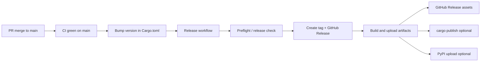

# Release workflow

Ontographia ships **Rust crates + CLI**, a **Python wheel** (PyPI), and **Go bindings** (cgo + FFI). Releases are cut from `main` only.

## Flow



1. Merge feature work to `main` and confirm [CI](https://github.com/edgesentry/ontographia/actions/workflows/ci.yml) passes.
2. Bump the workspace version on `main` (see [Version bumps](#version-bumps)) — **no local git tag**.
3. Run the **[Release](https://github.com/edgesentry/ontographia/actions/workflows/release.yml)** workflow (see below).
4. The workflow runs **preflight** (same checks as the old Release check), **creates `vX.Y.Z` + GitHub Release**, then builds and uploads artifacts.

**Immutable tags:** preflight fails if `vX.Y.Z`, `release-processed/vX.Y.Z`, or `bindings/go/vX.Y.Z` already exists on the remote. After a successful start, `release-processed/vX.Y.Z` is claimed; the same version cannot be re-released — bump the version in `Cargo.toml`.

## Option A — GitHub Actions button

1. Open **Actions → Release**.
2. Click **Run workflow** (branch must be `main`).
3. Enter **version** without the `v` prefix (e.g. `0.1.1`) — must match `[workspace.package] version` in `Cargo.toml`.
4. Click **Run workflow**.

Watch progress on the workflow run page. On success, assets appear on the [Releases](https://github.com/edgesentry/ontographia/releases) page.

## Option B — CLI

Requires [GitHub CLI](https://cli.github.com/) (`gh`) authenticated with `repo` scope.

### Full release (preflight + trigger workflow)

```bash
# 1. Bump version on main (via PR or locally)
scripts/bump-version.sh 0.1.1 --commit
git push origin main

# 2. Preflight + trigger Release workflow
scripts/trigger-release.sh 0.1.1

# 3. Watch the run
gh run watch --workflow Release
```

`trigger-release.sh` runs `preflight-release.sh` then `gh workflow run Release`.

### Preflight only (no release)

Use this to validate before clicking **Run workflow** in the UI, or after bumping the version locally:

```bash
bash scripts/preflight-release.sh 0.1.1
```

Equivalent to:

```bash
bash scripts/verify-release-version.sh v0.1.1
bash scripts/verify-tag-not-exists.sh v0.1.1
bash scripts/release-check.sh
```

### Trigger workflow only (skip local preflight)

```bash
gh workflow run Release --ref main -f version=0.1.1
```

The workflow always runs preflight on the runner; local preflight is optional but recommended.

## Version bumps

**Single source of truth:** root `Cargo.toml` → `[workspace.package] version`.

| Component | Where version lives |
|-----------|---------------------|
| Rust (all crates) | `version.workspace = true` → workspace version |
| Python wheel | `pyproject.toml` `dynamic = ["version"]` → `bindings/python/Cargo.toml` via maturin |
| Go | No file; `bindings/go/vX.Y.Z` tag created by the release workflow |

```bash
scripts/bump-version.sh 0.1.1 --commit
```

The release workflow rejects versions that do not match `Cargo.toml` (`scripts/verify-release-version.sh`).

## GitHub secrets (optional registry publish)

| Secret | Purpose |
|--------|---------|
| `CARGO_REGISTRY_TOKEN` | `cargo publish` for `ontographia-core`, `-adapters`, `-schema`, `-cli` |
| `PYPI_API_TOKEN` | `maturin upload` to PyPI |

| Variable | Purpose |
|----------|---------|
| `PUBLISH_TO_REGISTRIES` | Set to `true` to enable crates.io / PyPI publish jobs |

Without registry settings, the workflow still uploads **GitHub Release assets**.

## Install after release

### CLI (GitHub Release or crates.io)

```bash
cargo install ontographia-cli
```

```bash
ontographia build --ontology manufacturing.native.yaml --intent intent.json --json
ontographia schema manufacturing.native.yaml --out constraints.cypher --json-out schema.json
```

### Rust libraries

```toml
ontographia-core = "0.1"
ontographia-adapters = "0.1"
ontographia-schema = "0.1"
```

### Python

Supported: **3.11, 3.12, 3.13** (`requires-python = ">=3.11"`). CI runs Python smoke and Neo4j integration on all three; releases ship Linux wheels for each.

```bash
pip install ontographia
```

### Go

```bash
go get github.com/edgesentry/ontographia/bindings/go@v0.1.1
```

Download the matching `libontographia_ffi-*` archive from GitHub Releases for cgo linking.

The release workflow creates `bindings/go/vX.Y.Z` automatically.

## Artifacts

| Artifact | Contents |
|----------|----------|
| `ontographia-{version}-{target}.tar.gz` | `ontographia` CLI binary |
| `libontographia_ffi-{version}-{target}.tar.gz` | Shared library for Go/cgo |
| `ontographia-{version}-*.whl` | Python package |

## Related

- [architecture.md](architecture.md)
- [AGENTS.md](https://github.com/edgesentry/ontographia/blob/main/AGENTS.md)
